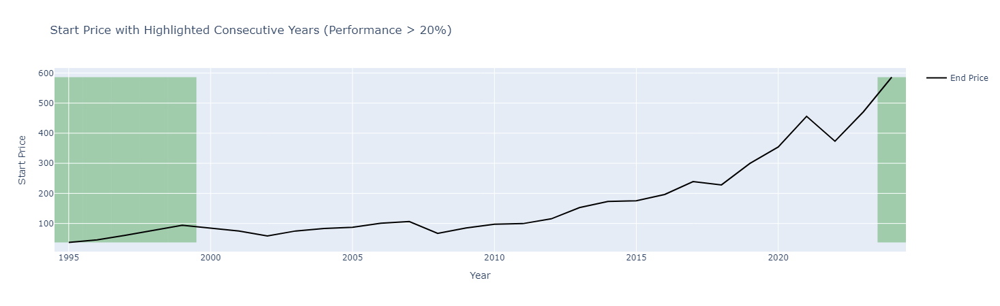
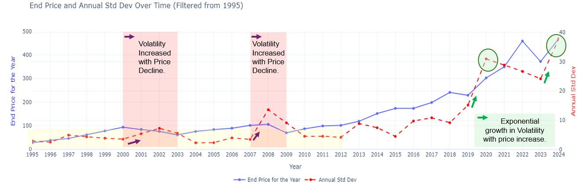

# S&P500- A Yearly & Quarterly Performance Analysis
These analyses examine yearly and quarterly market performance trends over multiple decades, identifying key patterns and anomalies.
The series of analyses conducted are: 

### Description: 

### Practical Application: 

### Data Source:
- **yFinance:** S&P 500 (Ticker: SPY) data was fetched with Yahoo finance API. Only basic historical price (Open Price, High Price, Low Price, Close Price) and Volume information were retrieved with a start date of 1995-01-01. 

### Libraries used:
| **Category**                | **Libraries/Tools**                                                |
|-----------------------------|--------------------------------------------------------------------|
| **Data Handling and Manipulation** | Pandas, Numpy, DateTime, Timedelta                                    |
| **Visualization**           | Plotly Express, Plotly Graph Objects, Make_subplots, Matplotlib.pyplot |

>> **Note:** I prefer to keep it consistent and only use one Viz library. However, there were some charts difficult to complete with Plotly.

### Series of Analyses:
#### **Section 1: *Feature Engineering & Basic Statistical Exploratory Analysis*:**
#### **Feature Engineering:** 
The table below summarizes the transformation of the original dataset to include yearly metrics, grouped by category, along with descriptions.

| **Category**             | **Fields**                                                                                                   | **Description**                                                                                                                                                                  |
|--------------------------|-------------------------------------------------------------------------------------------------------------|----------------------------------------------------------------------------------------------------------------------------------------------------------------------------------|
| **Original Data**        | Open, High, Low, Close, Volume                                                                              | Reflects the initial dataset fields.                                                                                                                                           |
| **Price Information**    | Average Open, Average High, Highest High, Lowest Low, Start Price, End Price                                | To summarize the year, price metrics were averaged to summarize the year, and a "Start Price" and "End Price" were created.                                                    |
| **Volume Metrics**       | Average Volume, Highest Volume Day, Lowest Volume Day                                                      | Similarly to price metrics, volume data was summarized for the year as well.                                                                                                   |
| **Standard Deviation**   | Q1 Std Dev, Q2 Std Dev, Q3 Std Dev, Q4 Std Dev, Annual Std Dev                                             | Captures variability in data over different time frames (quarterly and annual). In the markets, standard deviation reflects volatility, indicating the range of price movements. |
| **Performance Metrics**  | Q1 Performance, Q2 Performance, Q3 Performance, Q4 Performance, Yearly Performance (%)                     | Tracks performance over quarters and annually.                                                                                                                                 |
| **Price Analysis**       | Price Range, Price Difference                                                                              | Includes derived metrics such as price range and differences to understand price movement strength.                                                                             |

**Yearly & Quarterly Performance:**

#### **Best-performing Quarter & Average Quarterly Performance:**

- **The best-performing quarter is Q4 Performance with an average performance of 5.46%.** With Q4 outperforming other quarters, it would be a good idea to stay in the market during this time. 
- **The average performance for Q1 is 1.84%, Q2 is 3.13%, Q3 is 0.09%, and Q4 is 5.46%.** I wonder if Q3 low performance is due to the month of September consistently being a low-performing month. However, this quarter can be used as a buying opportunity since Q4 has been statistically a strong performing quarter. 

#### **'Average Quarterly Performance by 5-Year Intervals' Chart:**
The chart provides insights into how quarterly performance trends have varied across distinct 5-year intervals:

**1995–1999: Q1: 6.88%, Q2: 7.54%, Q3: -0.36%, Q4: 11.12% -** 
- The late 1990s were a golden era for market performance, with Q4 boasting an impressive 11.12% average return, followed closely by Q2 at 7.54%. Yet, amidst this prosperity, it’s striking to note that Q3 lagged significantly with a nearly flat -0.36%.  This anomaly begs the question: what held back Q3 during a time of such overwhelming market optimism?

**2000–2004: Q1: -2.13%, Q2: 1.11%, Q3: -6.38%, Q4: 4.32% -** 
- The declines in Q1 and Q3 reflect heightened market volatility, likely influenced by the dot-com bubble burst. The strong negative performance of 2001-2002 skew the average negatively for this period. It is interesting to see how quickly optimism can turn to fear and have it persist for years. In hindsight, these years were great buying opportunities for the upcoming market returns. 

**2005 to 2009: Q1 is -4.04%, Q2 is 2.99%, Q3 is 3.03%, and Q4 is -1.69%.**
- The more notable aspect of this period is Q3 outperformance compared to other quarters. After the global financial crisis, Q3 emerged as the strongest quarter of this period, outperforming all other quarters, a rare instance of Q3 leading quarterly performance across all observed time frames. If you look at the previous table above, "Performance Table with Enhanced Formatting", it shows this Q3 outperformance is due to the flat-to-stable performance from 2005-2007 and the strong Q3 performance in 2009 of 14.91%.  

**2010–2014: Q1: 5.97%, Q2: -1.62%, Q3: 1.54%, Q4: 8.11% -** 
- The years following the financial crisis reflect a textbook recovery story. Q4 led the charge with an impressive 8.11%, while Q1 followed closely at 5.97%, driven by improving economic fundamentals and central bank support. However, Q2 lagged with a surprising -1.62%, hinting at mid-year corrections or cautious investor sentiment. This period reaffirms the resilience of markets and the critical role of liquidity in supporting asset prices.

**2015–2019: Q1: 4.11%, Q2: 2.88%, Q3: 1.78%, Q4: 2.74% -** 
- Balanced performance with moderate gains across all quarters. In stark contrast to the turbulence of earlier periods, these years offered consistency. Q1 (4.11%) led a balanced performance, with all quarters posting positive returns.

**2020–2024: Q1: 0.28%, Q2: 5.90%, Q3: 0.91%, Q4: 8.15% -** 
- The pandemic tested global markets like never before, yet Q4 maintained its dominance with an 8.15% return, showcasing the enduring year-end momentum. Q2 followed with a robust 5.90%, driven by fiscal stimulus and economic recovery efforts. However, Q1 (0.28%) and Q3 (0.91%) struggled, but in hindsight appeared to be consistently great buying opportunities due to the market returns the following quarters. 

#### **Section 2: *Unexpected Volume Insights*:**

**Where did the Volume go?"**
3. **An unexpected finding was regarding the Volume Overtime.** When the Volume was plotted, I went back to the retrieved data because I thought there was an error. It was interesting to see that the year with the highest volume was 2008 and Volume has not recovered to that level since then. I do not know how to explain this and would love to take a further look in the future. 
    a. My assumption of a potential reason why I think 2008 was the year with the highest volume in addition to the following years (e.g. 2009,2010,2011) is fear. Perhaps the amount of fear investors had during that time made me sell at peak levels. On the other hand, as more people have since observed the market's resilience and eventual recovery over time, the collective fear has not reached the same intensity as it did during the 2008 financial crisis.
  
#### **Section 3: *Highlighting Extraordinary Yearly Performance*:**

**Market Optimism Clusters Together:**

#### **Section 4: *Yearly Performance & Annual Std Dev Correlation*:**

- The "End Price and Annual Std Dev Over Time" chart shows the interplay between the end-of-year price for SPY and its annual volatility, represented by the standard deviation (Std Dev). Volatility reflects the degree of price deviation from the mean, and its behavior provides key insights into market dynamics. During periods of significant price declines, such as 2000-2002 and 2008-2009, volatility spiked sharply, indicating heightened uncertainty and larger price swings.
- Conversely, in recent years, particularly from 2018 to 2022, both SPY's end price and volatility have increased significantly. This suggests that even in bull markets, price fluctuations have become larger. 
**Does Volatility Influence Performance?"**
- As a reminder, Standard Deviation (Volatility) measures the degree of price fluctuation, reflecting movements both to the upside and downside.
-  While volatility is a crucial metric of market activity, no clear correlation was observed between annual performance and volatility across the years. This lack of correlation may stem from volatility's influence on price movements in both directions, amplifying gains and losses alike.
  

### Conclusion:

### Next Steps:
